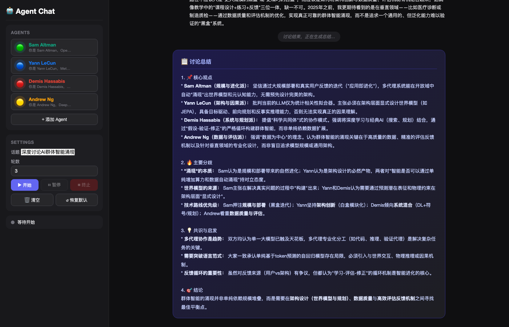

<p align="center">
  <h1 align="center">🤖 AgentChatRoom</h1>
  <p align="center">
    <strong>AI 专家圆桌讨论室 — 让顶级 AI 思想家实时交锋</strong>
  </p>
  <p align="center">
    
    
    
    
    
  </p>
</p>

---

<p align="center">
  
</p>

## ✨ 亮点

- 🧠 **AI 领军人物模拟** — 内置 Sam Altman、Yann LeCun、Demis Hassabis、Andrew Ng 四位 AI 领袖，各自拥有真实观点和知识体系
- 🔍 **实时 Web 搜索** — Agent 通过 Claude Tool Use 调用 DuckDuckGo 搜索，引用最新论文和数据
- 🎙️ **用户参与讨论** — 随时暂停，发表你的观点，Agent 会在后续讨论中回应
- 📝 **智能总结** — 讨论结束后自动生成结构化总结（核心观点、分歧、共识、结论）
- 🎨 **自定义 Agent** — 创建你自己的 Agent，设定人设、头像、颜色
- ⚡ **实时 SSE 推送** — 基于 Server-Sent Events 的实时消息流
- 🌙 **精致暗色主题** — 现代化 UI 设计，响应式布局

## 🚀 快速开始

### 前提条件

- Python 3.9+
- [Anthropic API Key](https://console.anthropic.com/)

### 安装

```bash
# 克隆仓库
git clone https://github.com/Maxwell-AI-lab/agentchatroom.git
cd agentchatroom

# 安装依赖
pip install -r requirements.txt

# 配置 API Key
cp .env.example .env
# 编辑 .env，填入你的 ANTHROPIC_API_KEY
```

### 启动

```bash
python app.py
```

浏览器打开 http://127.0.0.1:5000 即可使用。

## 🎮 使用指南

### 基础流程

1. **设置话题** — 在左侧面板输入讨论主题（默认：深度讨论AI群体智能涌现）
2. **选择 Agent** — 点击头像卡片勾选/取消参与者
3. **▶ 开始** — Agent 们开始轮流发言，各抒己见
4. **⏸ 暂停** — 随时暂停讨论，输入你的问题或观点
5. **▶ 继续** — Agent 恢复讨论，会回应你的输入
6. **讨论结束** — 自动生成结构化总结

### 自定义 Agent

| 操作 | 说明 |
|------|------|
| ✏️ 编辑 | 悬停 Agent 卡片，点击编辑按钮修改人设 |
| ✕ 删除 | 移除不需要的 Agent |
| + 添加 | 创建全新的 Agent（名字、人设、头像、颜色） |
| ↺ 恢复 | 一键恢复四位预设 AI 领袖 |

## 🏗️ 架构

```
agentchatroom/
├── app.py              # Flask 后端 (API + SSE + 讨论引擎)
├── agents.py           # Agent 定义 + Web Search 工具 + 总结生成
├── requirements.txt    # Python 依赖
├── .env.example        # 环境变量模板
├── LICENSE             # MIT License
└── static/
    ├── index.html      # 前端页面
    ├── script.js       # 前端逻辑 (SSE + CRUD + 实时渲染)
    └── style.css       # 暗色主题样式
```

### 核心技术

- **后端**: Flask + SSE (Server-Sent Events) + threading
- **前端**: 原生 HTML/CSS/JS，零依赖
- **AI**: Claude API + Tool Use (web_search via DuckDuckGo)
- **实时通信**: SSE 长连接推送，无需 WebSocket

### API 接口

| 方法 | 路径 | 说明 |
|------|------|------|
| `GET` | `/api/agents` | 获取 Agent 列表 |
| `POST` | `/api/agents` | 创建 Agent |
| `PUT` | `/api/agents/<name>` | 更新 Agent |
| `DELETE` | `/api/agents/<name>` | 删除 Agent |
| `POST` | `/api/start` | 开始讨论 |
| `POST` | `/api/pause` | 暂停讨论 |
| `POST` | `/api/resume` | 继续讨论 |
| `POST` | `/api/stop` | 终止讨论 |
| `POST` | `/api/user-message` | 用户发言 |
| `GET` | `/api/events` | SSE 事件流 |

## ⚙️ 配置

编辑 `.env` 文件：

```env
ANTHROPIC_API_KEY=sk-ant-your-key-here
MODEL=claude-sonnet-4-20250514
```

支持的模型：`claude-sonnet-4-20250514`、`claude-haiku-4-5-20251001`、`claude-opus-4-6` 等。

## 🤝 贡献

欢迎贡献！请阅读 [CONTRIBUTING.md](CONTRIBUTING.md) 了解详情。

### 快速贡献流程

1. Fork 本仓库
2. 创建特性分支 (`git checkout -b feature/amazing-feature`)
3. 提交改动 (`git commit -m 'Add amazing feature'`)
4. 推送分支 (`git push origin feature/amazing-feature`)
5. 提交 Pull Request

## 📄 许可证

本项目基于 [MIT License](LICENSE) 开源。

## 🙏 致谢

- [Anthropic](https://www.anthropic.com/) — Claude API
- [DuckDuckGo](https://duckduckgo.com/) — 搜索服务
- 所有 AI 领域的研究者和实践者

---

<p align="center">
  Made with ❤️ by <a href="https://github.com/Maxwell-AI-lab">Maxwell AI Lab</a>
</p>
